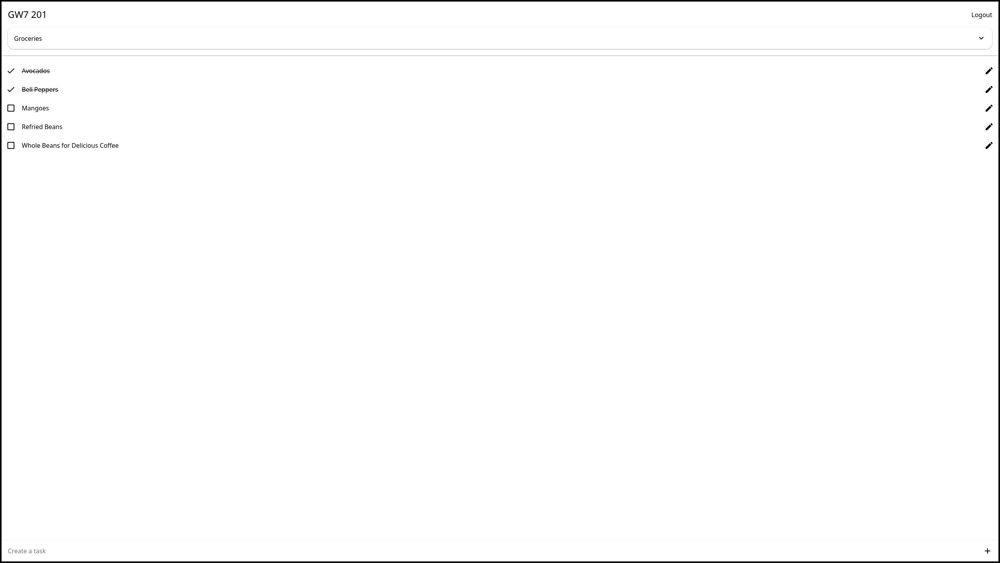

[![Contributors][contributors-shield]][contributors-url]
[![Forks][forks-shield]][forks-url]
[![Stargazers][stars-shield]][stars-url]
[![Issues][issues-shield]][issues-url]
[![MIT License][license-shield]][license-url]
[![LinkedIn][linkedin-shield]][linkedin-url]

 

  <h3 align="center">Tasks</h3>
  

    Full-Stack To-do List Web App
     
    <a href="https://tasks.griffindow.com">Website</a>
    ·
    <a href="https://github.com/griffinodow/tasks/issues">Report Bug</a>
  

## About

The classic to-do list app. Receive a random user ID and then create to-do lists. Full-stack web app and REST API; written in TypeScript, Sass, and SQL; featuring React, Node, and PostgreSQL. Unit tested in Jest and deployed in a microservice architecture with Docker.

## Built With

### General

| Languages  | Software   |
| ---------- | ---------- |
| TypeScript | Prettier   |
| CSS        | PostgreSQL |
| SQL        | Docker     |

### Client

| Frameworks | Libraries       |
| ---------- | --------------- |
| React      | React Hook Form |
| Next       | React Icons     |

### Server

| Frameworks | Libraries |
| ---------- | --------- |
| Node       | Express   |
|            | Jest      |
|            | Pg        |

## Getting Started

### Instructions

1. To get started setup a PostgreSQL server with a database and user for the server.
2. Run the `schema.sql` file in the database folder to initialize the database.
3. Configure server environment variables listed below before initializing the server.
4. Use the relevant commands below to either run the code in development or production modes.

### Commands

Ran in either the client or server folder.

| Intention               | Command         |
| ----------------------- | --------------- |
| Setup projects          | `npm install`   |
| Develop locally         | `npm run dev`   |
| Run tests (Server Only) | `npm run test`  |
| Production build        | `npm run build` |
| Run build files         | `npm run start` |
| Generate docs           | `npm run docs`  |

### Server Environment Variables

| Environment Variable | Description                 |
| -------------------- | --------------------------- |
| NODE_ENV             | "production", "development" |
| TASKS_PG_USER        | Postgres Username           |
| TASKS_PG_PASSWORD    | Postgres User Password      |
| TASKS_PG_HOST        | Postgres Hostname           |
| TASKS_PG_PORT        | Postgres Port               |
| TASKS_PG_DB          | Postgres Database Name      |

[contributors-shield]: https://img.shields.io/github/contributors/griffinodow/tasks.svg?style=for-the-badge
[contributors-url]: https://github.com/griffinodow/tasks/graphs/contributors
[forks-shield]: https://img.shields.io/github/forks/griffinodow/tasks.svg?style=for-the-badge
[forks-url]: https://github.com/griffinodow/tasks/network/members
[stars-shield]: https://img.shields.io/github/stars/griffinodow/tasks.svg?style=for-the-badge
[stars-url]: https://github.com/griffinodow/tasks/stargazers
[issues-shield]: https://img.shields.io/github/issues/griffinodow/tasks.svg?style=for-the-badge
[issues-url]: https://github.com/griffinodow/tasks/issues
[license-shield]: https://img.shields.io/github/license/griffinodow/tasks.svg?style=for-the-badge
[license-url]: https://github.com/griffinodow/tasks/blob/master/LICENSE
[linkedin-shield]: https://img.shields.io/badge/-LinkedIn-black.svg?style=for-the-badge&logo=linkedin&colorB=555
[linkedin-url]: https://linkedin.com/in/griffinodow
[product-screenshot]: https://github.com/griffinodow/tasks/raw/main/dist/images/tasks-screenshot.webp
